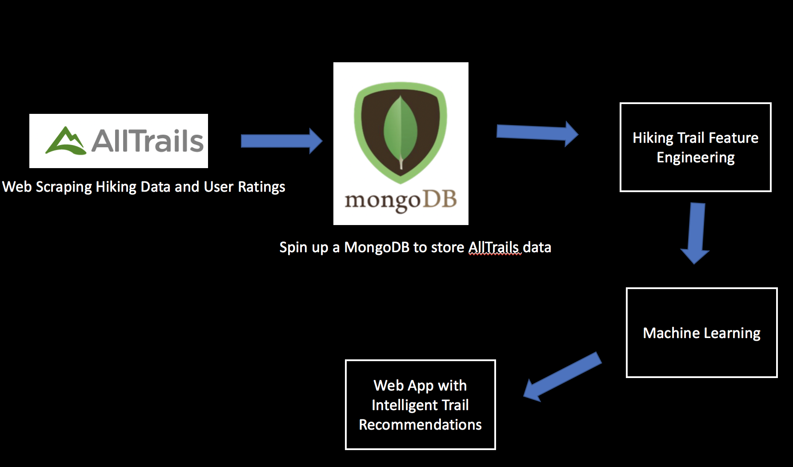

# Trail Secrets: An Intelligent Recommendation Engine for Finding Better Hikes
A full-stack machine learning [web application](https://www.trailsecrets.com) to find better hiking trails 

### Data Collection and Machine Learning Pipeline 

The one thing I really wish AllTrails had was personalized hiking suggestions based on hikes I've enjoyed in the past (i.e. if I liked hike X, I'll like hike Y because it has similar hiking trail features) or based on how I've rated hikes in the past (i.e. Goodreads personalized book recommendations based on your reviews).

I set out to ask the following questions:
1) *What types of intelligent recommendations would be useful for an AllTrails user/hiker?*

2) *Can I build a personalized recommendation engine that leverages AllTrails user hiking reviews?*

3) *Can I create a Power Ratings that blends together total number of reviews and average rating for a given hike?*

To answer these questions, I built a full-stack machine learning web application, [Trail Secrets](https://www.trailsecrets.com), which provides users with intelligent hiking recommendations based on AllTrails user reviews and hiking trail attributes. This application can help power AllTrails web, Android and iOS applications as the first set of intelligent algorithms that would personalize the AllTrails user experience to find better trails.

Comments or Questions? Please email me at: perryrjohnson7@gmail.com
